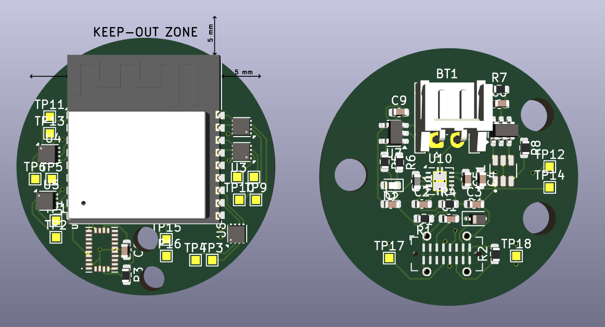
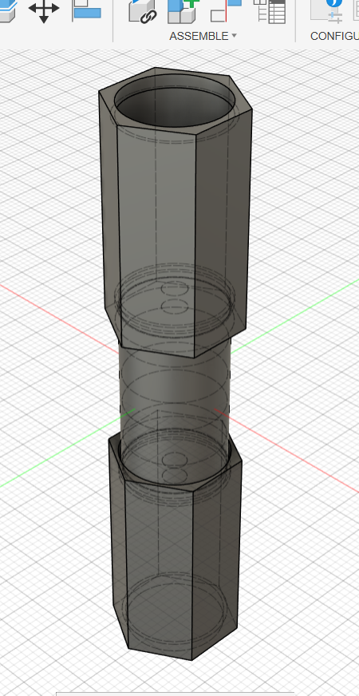

# Microbot

My first fully custom project inspired by the microbots from the movie Big Hero 6. My goal is to get into swarm robotics and I believe this is a HUGE leap in that direction, but a good moment to learn. I made this project to learn about swarm robotics and the potential application in environmental applications such as in deserts. 

| Part                    | Quantity | Specification                                      |
|-------------------------|----------|----------------------------------------------------|
| Microcontroller         | 1        | ESP32-C3-WROOM-02                                  |
| IMU Sensor              | 1        | BNO085 (9-axis Orientation)                        |
| Motor Drivers           | 5        | DRV8837 (H-Bridge)                                 |
| Buck-Boost Converter    | 1        | TPS63001 (Fixed 3.3V Output)                       |
| Li-Ion Charger          | 1        | MCP73831-2-OT                                      |
| Battery Protection IC   | 1        | DW01A                                             |
| Dual MOSFET             | 1        | FS8205 (For battery protection)                    |
| USB Connector           | 1        | USB-C Receptacle (14-Pin, USB 2.0)                 |
| Battery Header          | 1        | JST-EH (2-Pin, 2.50mm, Horizontal)                 |
| Solenoids               | 4        | Electromagnets (Amazon Reference)                  |
| Motors                  | 4        | Micro Motors (Amazon Reference)                    |
| Power Inductor          | 1        | 2.2µH (0603 Package)                               |
| Schottky Diode          | 1        | 1N5819WS (SOD-323)                                 |
| Capacitors              | 4        | 10µF (0603)                                       |
| Capacitors              | 2        | 4.7µF (0603)                                      |
| Capacitors              | 2        | 100nF (0603)                                      |
| Capacitors              | 1        | 0.1µF (0603)                                      |
| Resistors               | 2        | 5.1kΩ (0603)                                      |
| Resistors               | 2        | 2kΩ (0603)                                        |
| Resistors               | 2        | 470Ω (0603)                                       |
| Resistors               | 1        | 10kΩ (0603)                                       |
| Resistors               | 1        | 100Ω (0603)                                       |
| Indicator LED           | 1        | 0603 LED                                          |
| Hardware                | 18       | Test Points (1.0 × 1.0 mm)                         |
| Hardware                | 8        | Mouse-bite PCB Tabs                                |
